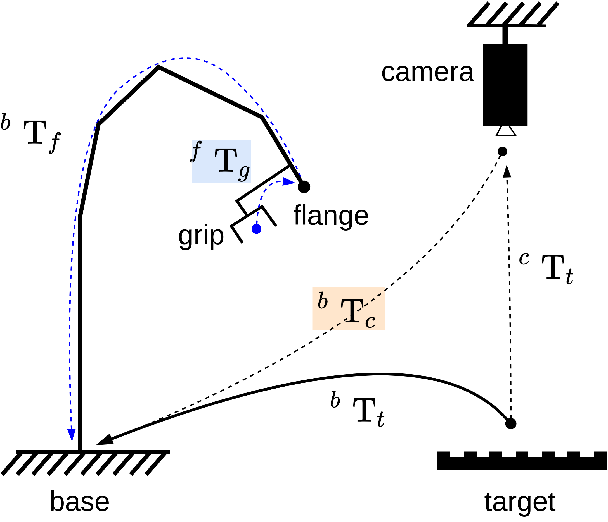
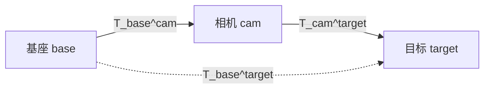
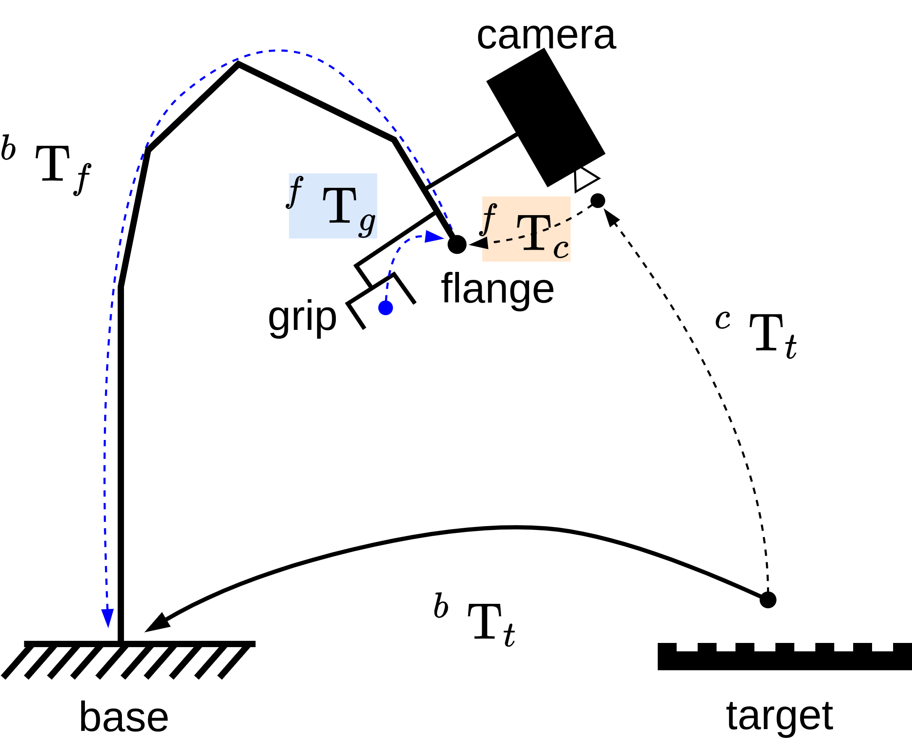
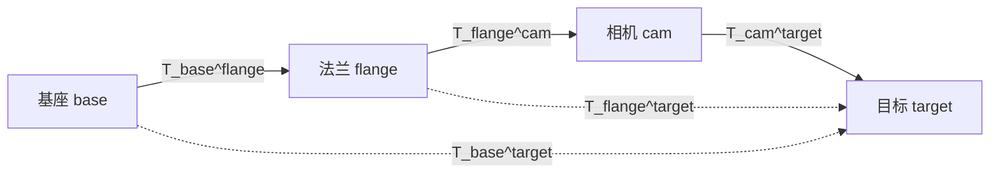

# hand_eyes_transformation

[](https://ubuntu.com/) [](https://en.cppreference.com/w/cpp/11) [](https://eigen.tuxfamily.org/) [](https://www.python.org/)

机器人手眼标定场景下的核心数学工具库，支持 **Pose6D (xyz + RPY)** 与 **Vector3D** 变换、欧拉角/轴角与 Eigen 齐次变换矩阵的互转。

## 🌟 核心特性
* **多语言支持**：核心逻辑由 C++11 (`interface/pose_vector_math.hpp`) 实现，并提供完全一致的 Python  (`interface/pose_vector_math.py`) 实现。
* **全场景覆盖**：涵盖“眼在手外” (Eye-to-Hand) 与 “眼在手上” (Eye-in-Hand) 两种主流标定模型的链式变换。
* **数学严谨**：默认采用 **XYZ + 外旋** 约定 ($R = R_z R_y R_x$)，详情参考内部文档。
* **零耦合设计**：C++ 部分为 Header-only 库设计，依赖极简，仅需 Eigen3。

---

## 🛠 变换场景说明

### 1. ETH（Eye-to-Hand，眼在手外）
相机固定于基座外部环境。通过已知相机在基座下的位姿（通过**ETH**标定得出，参考 [hand_eyes_calibration](https://www.google.com/url?sa=E&source=gmail&q=https://github.com/zhangnatha/hand_eyes_calibration) ），将**相机坐标系下目标物位姿**转换至机器人**基座坐标系**。


> 下图中的 ${ }^{c}\mathrm{~T}_{t}$ 代表 **目标物体在相机坐标系的表达**，如代码中使用的 `target_in_camera`，其它符号则同理



其链式关系如下，与 `main.cpp` 中 `pose3dMultiply(camera_in_base, target_in_camera)` 一致：

$$T_{\mathrm{base}}^{\mathrm{target}} = T_{\mathrm{base}}^{\mathrm{cam}} T_{\mathrm{cam}}^{\mathrm{target}}$$



### 2. EIH（Eye-in-Hand，眼在手上）

**相机**安装在**末端法兰**上随动。通过链式法则通过已知**相机在法兰坐标系下的位姿**（通过**EIH**标定得出，参考 [hand_eyes_calibration](https://www.google.com/url?sa=E&source=gmail&q=https://github.com/zhangnatha/hand_eyes_calibration) ），将**相机坐标系下目标物位姿**转换至**法兰坐标系**，再转换至**基座坐标系**。


> 下图中的 ${ }^{c}\mathrm{~T}_{t}$ 代表 **目标物体在相机坐标系的表达**，如代码中使用的 `target_in_camera`，其它符号则同理




其链式关系如下，与  `main.cpp` 中两次 `pose3dMultiply` 一致：
$$
T_{\mathrm{flange}}^{\mathrm{target}} = T_{\mathrm{flange}}^{\mathrm{cam}} T_{\mathrm{cam}}^{\mathrm{target}},\qquad
T_{\mathrm{base}}^{\mathrm{target}} = T_{\mathrm{base}}^{\mathrm{flange}} T_{\mathrm{flange}}^{\mathrm{target}}
$$




------

## 🚀 快速上手

### 依赖项

- **C++**: Eigen3 (如 `libeigen3-dev`)
- **Python**: `numpy`（见 `pip instal -r requirements-manual.txt`）

### 构建与运行 (C++)

Bash

```shell
cmake -B build -S . && cmake --build build
./build/main
```

### Python 验证

Bash

```shell
# 运行演示流程
python3 main.py
# 执行自检验证
python3 main.py --verify
```

## 📖 详细文档

关于数学约定、齐次变换公式及 API 的详细定义，请参阅 [assets/API.md](https://www.google.com/search?q=assets/API.md)。