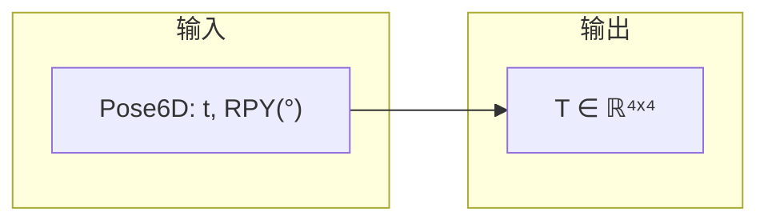
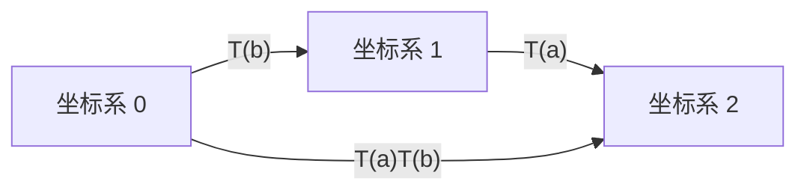
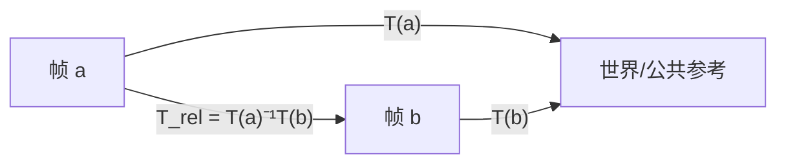
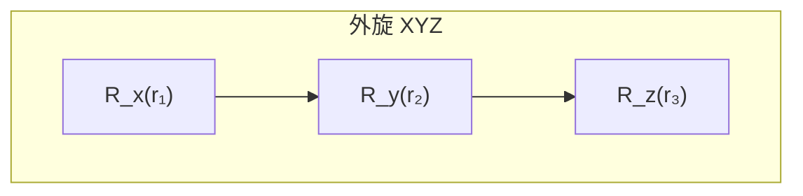
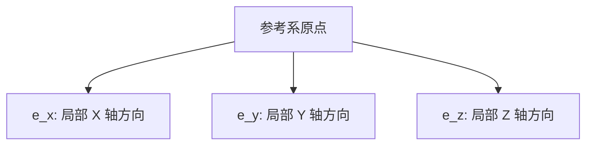
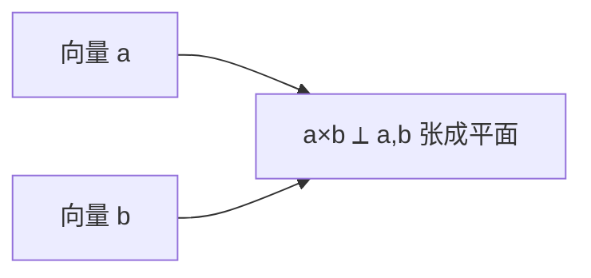

# `pose_vector_math` 接口说明

---

约定：**Pose6D** $`p=[x,y,z,r_x,r_y,r_z]^\top`$，平移单位与工程一致（如 mm），角度为**度**。默认旋转为 **XYZ 外旋**，旋转矩阵

```math
R_{\mathrm{def}}(r_x,r_y,r_z)=R_z(r_z)\,R_y(r_y)\,R_x(r_x)
```

其中 $`R_x,R_y,R_z`$ 为绕固定参考系 $`X,Y,Z`$ 轴的右手旋转（角度需先换算为弧度参与矩阵）。

齐次变换（位姿对应的 $`4\times4`$ 矩阵）：

```math
T(p)=\begin{bmatrix} R & t \\ 0 & 1 \end{bmatrix},\quad t=[x,y,z]^\top
```

列向量下，点变换为 $`\tilde{q}=T\,\tilde{p}`$（齐次坐标）。

---

## 位姿与矩阵

### `pose3dToMat4(p)` / `poseToMat4(p)`（别名）

**作用**：Pose6D → 齐次矩阵。

```math
T(p)=\begin{bmatrix} R_{\mathrm{def}}(r_x,r_y,r_z) & [x,y,z]^\top \\ 0\;0\;0 & 1 \end{bmatrix}
```



---

### `mat4ToPose(m)`

**作用**：齐次矩阵 → Pose6D；平移取 $`m_{0:2,3}`$，旋转块 $`R=m_{0:2,0:2}`$ 用 `rotationMatrixToRpyDeg` 解出 $`(r_x,r_y,r_z)`$。

**注意**：逆解函数固定为 **XYZ 外旋** 语义；若 $`R`$ 不是该参数化可表示的姿态，解可能数值不稳定或奇异（万向锁附近）。

---

### `pose3dMultiply(a, b)`

**作用**：位姿链乘，与矩阵一致。

```math
T_{\mathrm{out}} = T(a)\,T(b),\quad \text{pose3dMultiply}(a,b)=\text{mat4ToPose}\bigl(T_{\mathrm{out}}\bigr)
```

几何上：先按 $`b`$ 变换，再按 $`a`$ 变换（与 $`T(a)T(b)`$ 作用于齐次坐标列向量的顺序一致）。



---

### `pose3dInverse(p)`

**作用**：求 $`T(p)^{-1}`$。

```math
T^{-1}=\begin{bmatrix} R^\top & -R^\top t \\ 0 & 1 \end{bmatrix}
```

---

### `pose3dOffset(a, b)`

**作用**：在齐次矩阵意义下的**相对位姿**（从 $`a`$ 到 $`b`$ 的左乘增量常用形式）：

```math
T_{\mathrm{rel}} = T(a)^{-1}\,T(b),\quad \text{pose3dOffset}(a,b)=\text{mat4ToPose}(T_{\mathrm{rel}})
```



若 $`T(a),T(b)`$ 表示同一参考系下的绝对位姿，则 $`T_{\mathrm{rel}}`$ 把 **$`b`$ 在 $`a`$ 坐标系下** 的关系表达出来。

---

### `pose3dDistance(a, b)`

**作用**：仅比较**平移**欧氏距离，姿态不参与。

```math
d=\bigl\|[x_b-x_a,\;y_b-y_a,\;z_b-z_a]^\top\bigr\|_2
```

---

### `pose3dAngle(p1, p2)`

**作用**：先算相对位姿 $`T_{\mathrm{rel}}=T(p_1)^{-1}T(p_2)`$，取其旋转块 $`R_{\mathrm{rel}}`$，再用 Eigen `AngleAxis` 得到**轴角**：返回转角 $`\theta`$（度）与单位轴 $`\hat{n}`$。

```math
R_{\mathrm{rel}} = R(\hat{n},\theta),\quad \theta\in[0,\pi]\ (\text{由 Eigen 约定})
```

---

### `pose3dGetTrans(p)` / `pose3dGetRpy(p)`

**作用**：分别返回 $`[x,y,z]^\top`$ 与 $`[r_x,r_y,r_z]^\top`$（度），不做坐标变换。

---

## 欧拉角与旋转矩阵

### `rpyDegToRotationMatrix(r1_deg, r2_deg, r3_deg, rpy_type, ref_type)`

**作用**：按 `RPYType` 的轴序字符串（如 `XYZ`）取三次绕基轴旋转，角度为**度**；合成规则：

- **外旋（EXTRINSIC）**：$`R = R_3 R_2 R_1`$（与代码中 `m3*m2*m1` 一致），$`R_i`$ 为第 $`i`$ 步绕**固定参考系**对应轴的旋转。
- **内旋（INTRINSIC）**：$`R = R_1 R_2 R_3`$。

对默认 `XYZ` + `EXTRINSIC`：

```math
R = R_z(r_3)\,R_y(r_2)\,R_x(r_1)
```



---

### `rotationMatrixToRpyDeg(r)`

**作用**：给定 $`3\times3`$ 旋转矩阵 $`R`$，解出 $`(r_x,r_y,r_z)`$（度），**固定**为与默认外旋 XYZ 一致的逆解（即假设 $`R \approx R_z R_y R_x`$）。实现含万向锁分支（$`|r_y|\approx90^\circ`$）。

---

### `getBaseRotMatrix(axis, angle_rad)`

**作用**：单轴基元旋转 $`R_x,R_y,R_z`$ 之一，`angle_rad` 为弧度。

---

### `getRPYOrderStr(type)`

**作用**：枚举 `RPYType` → 轴序字符串（如 `"XZY"`），供 `rpyDegToRotationMatrix` 内部拼旋转。

---

## 轴向量与轴角

### `rpyToRot(rpy_deg)`

**作用**：$`R=\text{rpyDegToRotationMatrix}(r_x,r_y,r_z)`$，返回 $`R`$ 的三列：

```math
[\mathbf{e}_x,\mathbf{e}_y,\mathbf{e}_z],\quad \mathbf{e}_i\in\mathbb{R}^3
```

即**随体位姿坐标系**各轴在参考系下的方向（与 $`R`$ 的列一致）。



---

### `rotToRpy(v1, v2, v3)`

**作用**：用三个向量（代码中会**单位化**）作为 $`R`$ 的列构成旋转矩阵，再调用 `rotationMatrixToRpyDeg`。若三列近似不正交或 $`\det(R)\not\approx 1`$，抛出 `invalid_argument`。

---

### `rpyToAxisAngle(rpy_deg)` / `axisAngleToRpy(axis, angle_deg)`

**作用**：欧拉（默认约定下）与轴角互转，中间经旋转矩阵：

```math
R=\text{rpyDegToRotationMatrix}(\cdots),\quad
(\hat{n},\theta)=\mathrm{AngleAxis}(R)
```

```math
R = \mathrm{Rot}(\hat{n},\theta_{\mathrm{rad}}),\quad \theta_{\mathrm{rad}}=\frac{\pi}{180}\theta_{\mathrm{deg}}
```

`axisAngleToRpy` 要求 `axis` 非零（否则抛异常）。

---

## 三维向量（`Vector3D` = `Eigen::Vector3d`）

### `vector3dNorm(v)`

```math
\|v\|_2=\sqrt{v_x^2+v_y^2+v_z^2}
```

---

### `vector3dNormalized(v)`

```math
\hat{v}=\begin{cases} v/\|v\|_2,& \|v\|_2\ge 10^{-15}\\ v,& \text{否则} \end{cases}
```

（零向量时返回原向量，避免除零。）

---

### `vector3dCross(a, b)` / `vector3dDot(a, b)`

**作用**：标准叉积与点积。

```math
a\times b,\quad a\cdot b
```



---

## 杂项

### `namespace pose_vector_math::custom::pi()`

**作用**：圆周率常量，供角度↔弧度换算使用。

---

## Python 对应关系

`interface/pose_vector_math.py` 中 `PoseVectorMath` 的静态方法与上表同名 API 语义对齐（NumPy 矩阵）；阅读本文件即可对照 C++ 调用。
